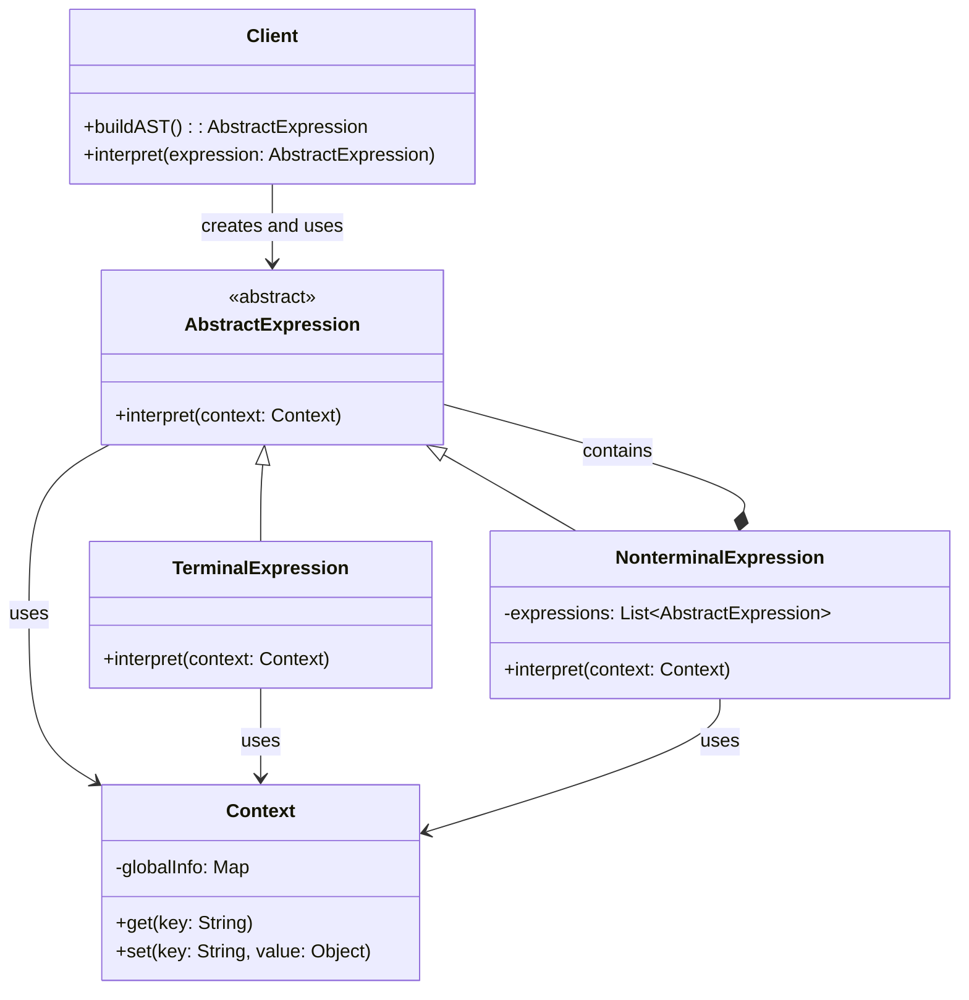

+++
date = '2025-08-06T16:27:12+03:00'
draft = true
title = 'Interpreter Pattern'
+++

# Terminology

- Language grammar - a set of rules, which defines how to correctly form language constructions.
- Syntax - a part of grammar, which defines only an order of elements in the sentence, sentence structure, available element combinations.
- Abstract syntax tree (AST) - a tree-like data structure, which represents sentence syntax structure or expressions according to language grammar.
- Terminal expressions are the simplest language elements, which can no longer be decomposed into smaller parts.
- Non-terminal expression - a complex element, which can be decomposed into other expressions (terminal and/or non-terminal).
- "to interpret", in the pattern context, means to **analyze and execute** commands or expressions, which are written in a specific language.

# Definition

**Interpreter** - it's a behaviour design pattern, which describes a way to represent language grammar by a class system, where each class is responsible for only one grammar rule, language sentences are interpreted by building and visiting an abstract syntax tree from instances of these classes.

# Terms of use

1. You have a special language (set of commands or rules), which needs to be executed in the program, and these commands can be decomposed into simple parts and represented as a tree.
2. Language grammar is easy. If many rules exist, you need to create a lot of classes, code will be complex and hard to maintain.
3. Performance is not critical. Expression can include a lot of copies of other expressions, which may cause performance issues.

# Structure

1. **AbstractExpression** - abstract expression. Defines a common (for all nodes of abstract syntax tree) expressions handling interface.
2. **TerminalExpression** - terminal expression which implements terminal symbols handling interface. Each **type** of terminal symbol needs a class.
3. **NonterminalExpression** - non-terminal expression which implements non-terminal symbol handling interface. These handling operations call **sub-expressions**.
4. **Context** - context which is global with regard to interpreter information and is used by all nodes for data exchange and state saving.
5. **Client** - client which creates (or receives already built) expression tree and runs the interpretation.

# Pipeline

1. Client creates (or receives already built) sentence tree, where nodes include objects of terminal and non-terminal classes.
2. Client prepares context with initial data and runs tree handling.
3. Non-terminal expressions handle their sub-expressions by calling their handling methods.
4. Terminal expressions execute concrete operations and end the chain of processing.

# Disadvantages

- Hard to maintain as the grammar grows.
- Performance - creating a lot of objects causes performance issues.

# Advantages

- It's easy to add new rules, just add a new class.
- Simple implementation - each class decides only its own task.
- Transparent structure - code represents the grammar structure.
